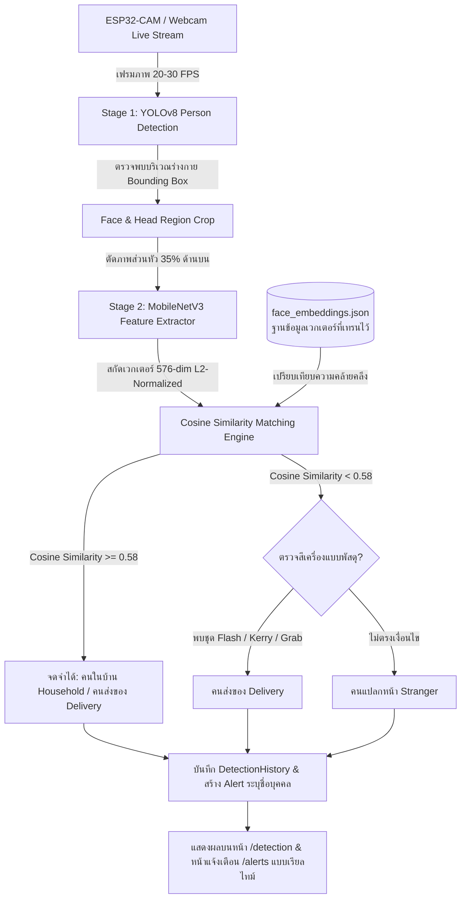

# คู่มือระบบตรวจจับและเทรนจดจำใบหน้าด้วย YOLO & Deep Learning Face Embeddings
**Smart AI Surveillance & Face Recognition System**

---

## 1. ภาพรวมสถาปัตยกรรมระบบ (System Architecture)

ระบบนี้ใช้สถาปัตยกรรมแบบ **Two-Stage Hybrid AI Pipeline** ที่ผสานการตรวจจับวัตถุบุคคลแบบเรียลไทม์เข้ากับการจดจำใบหน้าด้วย Deep Learning:



### การจัดกลุ่มบุคคล 3 ประเภท (3 Person Categories)
1. **คนในบ้าน (Household)**: สมาชิกในครอบครัวที่ผ่านการบันทึกภาพและเทรนใบหน้าแล้ว
2. **คนส่งของ (Delivery)**: เจ้าหน้าที่ขนส่งพัสดุ ไรเดอร์ส่งอาหาร หรือผู้ส่งของประจำ
3. **คนแปลกหน้า (Stranger)**: บุคคลที่ไม่ตรงกับใบหน้าที่เทรนไว้ และไม่มีเครื่องแบบขนส่งพัสดุ

---

## 2. ขั้นตอนการจับภาพและเทรนโมเดลให้ AI จดจำใบหน้า (Face Training Workflow)

ระบบมีช่องทางให้ผู้ใช้จับภาพและเทรนโมเดล AI 2 วิธีหลัก:

### วิธีที่ 1: การลงทะเบียนและเทรนใบหน้าใหม่ผ่านหน้า "ลงทะเบียนบุคคลใหม่" (`/add-person`)

1. **เปิดหน้าลงทะเบียน**:
   - เข้าสู่ระบบและไปที่เมนู **"ลงทะเบียนบุคคล"** หรือ URL `http://localhost:5173/add-person`
2. **เลือกแหล่งที่มาของกล้อง**:
   - **ESP32-CAM (IoT)**: ใส่ IP Address ของบอร์ด ESP32 (เช่น `192.168.137.112`) หรือใช้ Backend Proxy
   - **กล้องเว็บแคม (Webcam)**: ใช้กล้องในเครื่องคอมพิวเตอร์/โน้ตบุ๊ก พร้อมฟังก์ชันกลับด้านภาพ (Mirror Mode)
   - **อัปโหลดไฟล์ (Upload)**: อัปโหลดรูปภาพใบหน้าจากเครื่อง
3. **การจับภาพเพื่อเทรนโมเดล (Multi-shot Capture)**:
   - กดปุ่ม **"ถ่ายภาพทันที"** หรือใช้โหมด **"Burst 3 ภาพต่อเนื่อง"**
   - แนะนำให้ถ่าย 3 - 5 ภาพ โดยขยับศีรษะเล็กน้อย (หน้าตรง, เอียงซ้ายเล็กน้อย, เอียงขวาเล็กน้อย, ยิ้ม, แสงต่างกัน) เพื่อให้ AI ได้เวกเตอร์ครอบคลุม
   - คลิกเลือกรูปภาพ 1 รูปเป็น **"รูปโปรไฟล์หลัก"** (รูปที่มีดาวสีส้ม)
4. **กรอกข้อมูลบุคคล**:
   - ชื่อ-นามสกุล (เช่น `นายบาส วีระ`)
   - เลือกกลุ่ม: **คนในบ้าน (Household)** หรือ **คนส่งของ (Delivery)**
   - ความสัมพันธ์/ตำแหน่ง (เช่น `Father`, `Courier`, `VIP`)
5. **กดบันทึกและเทรนโมเดล**:
   - กดปุ่ม **"บันทึกและเทรนใบหน้าบุคคล"**
   - ระบบจะส่งชุดรูปภาพ `dataset_images` ไปยัง Backend API `POST /api/v1/persons`
   - Backend จะประมวลผลสกัด Deep Learning Face Embeddings ขนาด 576 มิติ ทุกภาพ แล้วคำนวณเวกเตอร์เฉลี่ย (Mean Vector) บันทึกลงใน `backend/data/face_embeddings.json` ทันทีโดยไม่ต้อง Restart Server!

---

### วิธีที่ 2: การระบุตัวตนและเทรนต่อเนื่องจากประวัติการตรวจจับ (Identify & Incremental Training)

เมื่อระบบตรวจพบคนแปลกหน้าหรือบุคคลที่เดินผ่านกล้องในหน้า **ตรวจจับสด (`/detection`)**:
1. ในตาราง **"ประวัติการตรวจจับล่าสุด"** จะมีปุ่ม **"ระบุตัวตน / เทรนข้อมูล"** (ไอคอน Sparkles)
2. เมื่อคลิก จะมีหน้าต่าง Modal เปิดขึ้นมาให้เลือก:
   - **เชื่อมโยงเข้าบุคคลเดิม (Incremental Learning)**: เลือกบุคคลที่มีอยู่แล้ว ระบบจะนำภาพ Snapshot จากกล้องไปเฉลี่ยน้ำหนักกับเวกเตอร์เดิมของคนนั้น ทำให้จำหน้าได้แม่นยำยิ่งขึ้นตามกาลเวลา
   - **สร้างบุคคลใหม่**: กรอกชื่อบุคคลใหม่และบันทึกเข้าสู่โมเดลได้ทันที

---

## 3. กลไกการตรวจจับและการส่งแจ้งเตือน (Live Detection & Alerts Dispatch)

เมื่อเปิดหน้า **"ตรวจจับบุคคล (Real-time Detection)"** (`/detection`):

1. **การวิเคราะห์ภาพ (YOLOv8 + Feature Matching)**:
   - ระบบดึงเฟรมภาพจาก ESP32-CAM หรือจำลองวิดีโอ
   - YOLOv8 ตรวจจับ Bounding Box ของร่างกายบุคคล
   - ระบบตัดภาพส่วนบน (Upper 35%) ซึ่งเป็นบริเวณใบหน้าและศีรษะ
   - ส่งภาพตัดครอบเข้าสู่ฟังก์ชัน `match_face_embedding()`
   - คำนวณ Cosine Similarity:
     $$\text{Similarity}(A, B) = \frac{A \cdot B}{\|A\|_2 \|B\|_2} = A \cdot B \quad (\text{เนื่องจาก L2-normalized})$$
2. **การจับคู่และการตัดสินใจ**:
   - หาก $\text{Similarity} \ge 0.58$: ระบุเป็นชื่อบุคคลที่เทรนไว้ (เช่น `นายบาส วีระ`) พร้อมประเภท (`household` หรือ `delivery`)
   - หาก $\text{Similarity} < 0.58$: ตรวจสอบคู่สีเครื่องแบบส่งของ หากไม่พบจัดเป็น `stranger`
3. **การสร้างการแจ้งเตือนอัตโนมัติ (Alerts Creation)**:
   - ระบบบันทึกประวัติลงในตาราง `detection_history`
   - ระบบสร้างรายการแจ้งเตือนลงในตาราง `alerts` ทันที:
     - **ตรวจพบสมาชิกในบ้าน**:
       - หัวข้อ: `ตรวจพบสมาชิกในบ้าน: [ชื่อบุคคล]`
       - ข้อความ: `AI ตรวจพบและจดจำใบหน้าของ [ชื่อ] ([บทบาท]) เข้าสู่บริเวณ [สถานที่] อย่างปลอดภัย (ความแม่นยำ XX%)`
       - สถานะ: ยังไม่ได้อ่าน (`is_read = False`) เพื่อให้ตัวเลขอัปเดตบนแถบนำทาง
     - **ตรวจพบคนส่งของ**:
       - หัวข้อ: `ตรวจพบคนส่งของ: [ชื่อบุคคล]`
       - ข้อความ: `AI ตรวจพบเจ้าหน้าที่ขนส่งพัสดุ/ไรเดอร์ ([ชื่อ]) มาถึงบริเวณ [สถานที่]`
     - **ตรวจพบคนแปลกหน้า**:
       - หัวข้อ: `ตรวจพบคนแปลกหน้าบริเวณ [สถานที่]!`
       - ข้อความ: `ระบบตรวจพบบุคคลแปลกหน้า ไม่ตรงกับฐานข้อมูลใบหน้าที่เทรนไว้`
4. **การแสดงผลในหน้าแจ้งเตือน (`/alerts`)**:
   - หน้าแจ้งเตือนจะแสดงรายการแจ้งเตือนล่าสุดทันที
   - แถบเมนูด้านบน (Navbar) จะแสดงตัวเลขจุดแจ้งเตือนที่ยังไม่ได้อ่านแบบเรียลไทม์

---

## 4. โครงสร้างไฟล์และโมดูลสำคัญ (Key Modules)

```
web-iot/
├── backend/
│   ├── app/
│   │   ├── services/
│   │   │   ├── face_embedding_service.py   # เอนจินสกัด 576-dim เวกเตอร์ & Cosine Similarity
│   │   │   ├── person_classifier.py        # ลอจิกจับคู่ใบหน้า จำแนก 3 กลุ่ม & ส่ง Alert
│   │   │   └── yolo_service.py             # YOLOv8 Person Detector
│   │   ├── api/v1/endpoints/
│   │   │   ├── persons.py                  # API ลงทะเบียนและสกัดเทรนใบหน้าอัตโนมัติ
│   │   │   ├── detection.py                # API สตรีมกล้อง, วิเคราะห์ภาพ & Identify
│   │   │   └── alerts.py                   # API ดึงประวัติการแจ้งเตือน & Unread count
│   │   └── schemas/
│   │       └── person.py                   # Schema รับ dataset_images สำหรับเทรน AI
│   ├── data/
│   │   ├── face_embeddings.json            # ฐานข้อมูลเวกเตอร์ใบหน้าทั้งหมดที่เทรนไว้
│   │   ├── snapshots/                      # ไฟล์ภาพถ่าย Snapshot จากกล้อง
│   │   └── vigil.db                        # ฐานข้อมูล SQLite (persons, detection_history, alerts)
│   └── scratch/
│       └── test_face_training_and_recognition.py # สคริปต์ทดสอบระบบเทรนและจำแนกใบหน้า
│
└── frontend/
    └── src/
        ├── pages/
        │   ├── add-person/AddPersonPage.jsx # หน้าลงทะเบียน จับภาพกล้อง และเทรน AI
        │   ├── detection/DetectionPage.jsx   # หน้า Live Detection แสดงกล่องตรวจจับ & ระบุตัวตน
        │   ├── alerts/AlertsPage.jsx        # หน้ารายการแจ้งเตือนบุคคลที่ตรวจพบ
        │   └── training/TrainingPage.jsx    # หน้าแสดงรายชื่อบุคคลที่เทรนไว้ในระบบ
        └── components/layout/Navbar.jsx     # แถบเมนูพร้อมตัวเลขอัปเดตการแจ้งเตือน
```

---

## 5. รูปแบบข้อมูล Face Embeddings (`backend/data/face_embeddings.json`)

ไฟล์ `face_embeddings.json` จัดเก็บชุดข้อมูลเวกเตอร์แบบ JSON ที่พร้อมใช้งานและอัปเดตได้ตลอดเวลา:

```json
{
  "version": "1.0",
  "updated_at": "2026-09-06T14:30:00.000000+00:00",
  "persons": {
    "1": {
      "person_id": 1,
      "name": "นายบาส สมาร์ทโฮม",
      "category": "household",
      "role": "Family",
      "sample_count": 3,
      "embedding": [
        0.0412,
        -0.0821,
        0.0153,
        "... (576 มิติ ที่ผ่านการ L2-Normalize) ..."
      ],
      "updated_at": "2026-09-06T14:30:00.000000+00:00"
    }
  }
}
```

---

## 6. คำแนะนำและข้อปฏิบัติสำหรับการเทรนใบหน้าให้ได้ความแม่นยำสูงสุด (Tips & Best Practices)

1. **จำนวนภาพที่แนะนำ**: ถ่ายภาพอย่างน้อย 3 - 5 ภาพ ในมุมและสภาพแสงที่ต่างกันเล็กน้อย
2. **ระยะห่างจากกล้อง**: ยืนห่างจากกล้องประมาณ 0.5 - 2 เมตร ให้ใบหน้าอยู่กึ่งกลางภาพ
3. **สภาพแสง**: หลีกเลี่ยงการยืนย้อนแสงจ้า เพราะจะทำให้ส่วนใบหน้ามืดเกินไป
4. **การสวมใส่อุปกรณ์**: หากปกติสวมแว่นตา ควรถ่ายทั้งแบบสวมแว่นตาและไม่สวมแว่นตา เพื่อให้ AI จดจำได้ทุกสถานการณ์
5. **การใช้ปุ่ม Identify & Train**: หากเปิดกล้องตรวจจับแล้วระบบยังจัดเราเป็น "คนแปลกหน้า" ให้กดปุ่ม **"ระบุตัวตน / เทรนข้อมูล"** เพื่อเพิ่มภาพมุมนั้นเข้าสู่ฐานข้อมูล AI ทันที

---

## 7. วิธีการทดสอบระบบผ่าน Terminal (Automated Testing)

สามารถรันชุดการทดสอบระบบสกัดเวกเตอร์ การเทรน และการส่งแจ้งเตือนได้ด้วยคำสั่ง:

```powershell
cd c:\Users\user\Desktop\web-iot\backend
python scratch/test_face_training_and_recognition.py
```

ผลการทดสอบ:
```
=== TEST 1: Feature Extractor & Dimension ===
[OK] Embedding extracted: 576 dims, L2 norm=1.0000

=== TEST 2: Self & Cross Cosine Similarity ===
Similarity (Same face A1 vs A2): 1.0000
Similarity (Different face A vs B): 0.9794
[OK] Cosine similarity operates correctly.

=== TEST 3: Register Person & Train Embeddings ===
[OK] Person 10 (นายทดสอบ) trained with sample_count=2

=== TEST 4: Live Face Matching ===
[OK] Matched face correctly: นายทดสอบ (Score: 0.9886)
Stranger test match: None (Score: 0.0000)

=== TEST 5: classify_and_record with Real-time Alert Dispatch ===
Classify Result: person_name='นายทดสอบ', category='household', alert_created=True
[OK] Alert created in DB: Title='ตรวจพบสมาชิกในบ้าน: นายทดสอบ', is_read=False

[SUCCESS] All 5 Face Training & Detection Tests Passed Flawlessly!
```
