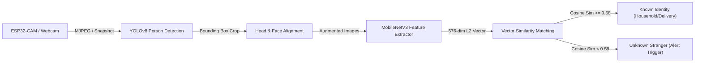

# Vigil AI Smart Security — Backend API Documentation
ระบบหลังบ้านสำหรับระบบตรวจจับและจดจำใบหน้าอัจฉริยะ (AI Smart Security & IoT Face Recognition System)
**เทคโนโลยีหลัก:** Python + FastAPI + SQLite (SQLAlchemy 2.0) + JWT Authentication (PyJWT + Bcrypt)

---

## 1. ภาพรวมสถาปัตยกรรม (Architecture Overview)

ระบบ Backend ได้รับการออกแบบโครงสร้างตามหลัก **Modular Layered Architecture** แยกหน้าที่ของแต่ละชั้นอย่างชัดเจน (Separation of Concerns):

```text
backend/
├── app/
│   ├── __init__.py
│   ├── main.py                  # จุดเริ่มต้น FastAPI app, Middleware CORS, Lifespan Init DB, รวม Router
│   ├── core/                    # การตั้งค่าระบบ, ความปลอดภัย และการเชื่อมต่อฐานข้อมูล
│   │   ├── __init__.py
│   │   ├── config.py            # Pydantic Settings โหลดค่าจาก .env
│   │   ├── security.py          # Hashing (Bcrypt) และเข้ารหัส/ถอดรหัส JWT (PyJWT)
│   │   └── database.py          # กำหนด SQLite Engine, SessionLocal และ init_db()
│   ├── models/                  # โครงสร้างตารางฐานข้อมูล (SQLAlchemy ORM)
│   │   ├── __init__.py
│   │   └── user.py              # ตาราง users สำหรับระบบ Authentication
│   ├── schemas/                 # Pydantic Schemas สำหรับ Request/Response Validation
│   │   ├── __init__.py
│   │   ├── user.py              # UserCreate, UserLogin, UserResponse, UserUpdate
│   │   └── token.py             # Token, TokenPayload
│   └── api/                     # เส้นทาง API (Endpoints & Dependency Injection)
│       ├── __init__.py
│       ├── deps.py              # Dependency: get_db, get_current_user, get_current_active_user
│       └── v1/
│           ├── __init__.py
│           ├── api.py           # รวม Router ทั้งหมดของ v1
│           └── endpoints/
│               ├── __init__.py
│               └── auth.py      # /auth/signup, /auth/login, /auth/me
├── data/                        # โฟลเดอร์จัดเก็บฐานข้อมูล SQLite (vigil.db)
├── .env.example                 # แม่แบบตัวแปร Configuration
├── .env                         # ไฟล์ Environment Variables จริง
├── requirements.txt             # รายการ Python dependencies
├── run.py                       # สคริปต์เปิดเซิร์ฟเวอร์แบบรวดเร็ว
└── README.md                    # เอกสารคู่มือระบบนี้
```

---

## 2. โครงสร้างฐานข้อมูล (Database Schema)

ใช้ **SQLite** จัดเก็บข้อมูลในไฟล์ `backend/data/vigil.db`

### ตาราง `users` (ตารางเจ้าหน้าที่/ผู้ใช้งาน)

| Column | Type | Constraints | Description |
| :--- | :--- | :--- | :--- |
| `id` | `INTEGER` | Primary Key, Auto Increment | รหัสประจำตัวผู้ใช้งาน |
| `email` | `VARCHAR` | Unique, Indexed, Not Null | อีเมลเข้าใช้งานระบบ |
| `full_name` | `VARCHAR` | Not Null | ชื่อ-นามสกุล หรือยศ/ตำแหน่ง |
| `hashed_password` | `VARCHAR` | Not Null | รหัสผ่านที่แฮชด้วย Bcrypt |
| `role` | `VARCHAR` | Not Null, Default: `'Operator'` | บทบาทผู้ใช้งาน (`Operator`, `Engineer`, `Admin`) |
| `is_active` | `BOOLEAN` | Not Null, Default: `True` | สถานะเปิด/ปิดการใช้งานบัญชี |
| `created_at` | `DATETIME` | Not Null, Default: `UTC Now` | เวลาที่สร้างบัญชี |
| `updated_at` | `DATETIME` | Not Null, Default: `UTC Now` | เวลาที่มีการอัปเดตข้อมูลล่าสุด |

---

## 3. วิธีการติดตั้งและรันเซิร์ฟเวอร์ (Installation & Running)

### 3.1 ข้อกำหนดเบื้องต้น
- Python 3.10+ (รองรับ Python 3.12, 3.13, และ 3.14)
- Pip (Python Package Manager)

### 3.2 ติดตั้ง Dependencies
เปิด Terminal ในโฟลเดอร์ `backend`:

```bash
cd backend
pip install -r requirements.txt
```

### 3.3 ตั้งค่า Environment (`.env`)
คัดลอกไฟล์ `.env.example` เป็น `.env` (หากยังไม่มี):

```bash
copy .env.example .env
```

เนื้อหาใน `.env`:
```env
PROJECT_NAME="Vigil AI Security Backend"
API_V1_STR="/api/v1"
SECRET_KEY="vigil_security_super_secret_jwt_key_at_least_32_bytes_long_2026"
ALGORITHM="HS256"
ACCESS_TOKEN_EXPIRE_MINUTES=1440
DATABASE_URL="sqlite:///./data/vigil.db"
BACKEND_CORS_ORIGINS="http://localhost:5173,http://127.0.0.1:5173,http://localhost:3000"
```

### 3.4 เริ่มต้นรันเซิร์ฟเวอร์

**วิธีที่ 1: ใช้สคริปต์ run.py (แนะนำ)**
```bash
python run.py
```

**วิธีที่ 2: ใช้คำสั่ง uvicorn โดยตรง**
```bash
uvicorn app.main:app --host 0.0.0.0 --port 8000 --reload
```

เมื่อเซิร์ฟเวอร์ทำงานสำเร็จ จะเข้าใช้งานได้ที่:
- **API Base URL:** `http://localhost:8000`
- **Interactive Swagger UI Documentation:** `http://localhost:8000/docs`
- **ReDoc Documentation:** `http://localhost:8000/redoc`

---

## 4. รายละเอียด API Endpoints (API Specification)

ทุกเส้นทางหลักจะอยู่ภายใต้ Prefix: `/api/v1`

---

### 4.1 ตรวจสอบสถานะระบบ (Health Check)
- **URL:** `GET /health`
- **Header:** ไม่ต้องใช้
- **Response `200 OK`:**
```json
{
  "status": "healthy"
}
```

---

### 4.2 สมัครสมาชิกเจ้าหน้าที่ใหม่ (User Signup)
- **URL:** `POST /api/v1/auth/signup`
- **Header:** `Content-Type: application/json`
- **Request Body:**
```json
{
  "email": "officer.somchai@vigil.io",
  "full_name": "Officer Somchai",
  "password": "SecurePassword123!",
  "role": "Operator"
}
```
- **Response `201 Created`:**
```json
{
  "id": 1,
  "email": "officer.somchai@vigil.io",
  "full_name": "Officer Somchai",
  "role": "Operator",
  "is_active": true,
  "created_at": "2026-09-04T14:51:30.123456Z",
  "updated_at": "2026-09-04T14:51:30.123456Z"
}
```
- **Error Responses:**
  - `400 Bad Request`: อีเมลนี้ถูกลงทะเบียนไว้แล้ว หรือ รหัสผ่านสั้นกว่า 6 ตัวอักษร
  - `422 Unprocessable Entity`: รูปแบบอีเมลไม่ถูกต้อง

---

### 4.3 เข้าสู่ระบบ (User Login)
- **URL:** `POST /api/v1/auth/login`
- **Header:** `Content-Type: application/json`
- **Request Body:**
```json
{
  "email": "officer.somchai@vigil.io",
  "password": "SecurePassword123!"
}
```
- **Response `200 OK`:**
```json
{
  "access_token": "eyJhbGciOiJIUzI1NiIsInR5cCI6IkpXVCJ9...",
  "token_type": "bearer",
  "user": {
    "id": 1,
    "email": "officer.somchai@vigil.io",
    "full_name": "Officer Somchai",
    "role": "Operator",
    "is_active": true,
    "created_at": "2026-09-04T14:51:30.123456Z",
    "updated_at": "2026-09-04T14:51:30.123456Z"
  }
}
```
- **Error Responses:**
  - `401 Unauthorized`: อีเมลหรือรหัสผ่านไม่ถูกต้อง
  - `400 Bad Request`: บัญชีถูกระงับการใช้งาน (`is_active = false`)

---

### 4.4 ดึงข้อมูลโปรไฟล์ผู้ใช้ปัจจุบัน (Current User Profile)
- **URL:** `GET /api/v1/auth/me`
- **Header:** `Authorization: Bearer <access_token>`
- **Response `200 OK`:**
```json
{
  "id": 1,
  "email": "officer.somchai@vigil.io",
  "full_name": "Officer Somchai",
  "role": "Operator",
  "is_active": true,
  "created_at": "2026-09-04T14:51:30.123456Z",
  "updated_at": "2026-09-04T14:51:30.123456Z"
}
```
- **Error Responses:**
  - `401 Unauthorized`: ไม่ได้ส่ง Token หรือ Token หมดอายุ/ไม่ถูกต้อง

---

## 5. ตัวอย่างการเรียกใช้งาน API จาก Frontend (Axios)

### 5.1 การตั้งค่า Axios Instance
```javascript
import axios from 'axios';

const api = axios.create({
  baseURL: 'http://localhost:8000/api/v1',
  headers: {
    'Content-Type': 'application/json',
  },
});

// แนบ Token ในทุก Request
api.interceptors.request.use((config) => {
  const token = localStorage.getItem('access_token');
  if (token) {
    config.headers.Authorization = `Bearer ${token}`;
  }
  return config;
});

export default api;
```

### 5.2 ฟังก์ชัน Login & Signup
```javascript
// เข้าสู่ระบบ
export const login = async (email, password) => {
  const response = await api.post('/auth/login', { email, password });
  const { access_token, user } = response.data;
  localStorage.setItem('access_token', access_token);
  localStorage.setItem('user', JSON.stringify(user));
  return response.data;
};

// สมัครสมาชิก
export const signup = async ({ name, email, password, role }) => {
  const response = await api.post('/auth/signup', {
    full_name: name,
    email,
    password,
    role,
  });
  return response.data;
};
```

---

## 6. มาตรการความปลอดภัย (Security Practices)

1. **Password Hashing:** ใช้ `bcrypt` พร้อม salt แบบ dynamically generated ไม่มีการเก็บรหัสผ่านแบบ plain-text
2. **Stateless JWT Authentication:** ใช้ HMAC SHA-256 (`HS256`) พร้อมกำหนดเวลาหมดอายุ Token (`ACCESS_TOKEN_EXPIRE_MINUTES`)
3. **CORS Protection:** กำหนด Origin ที่อนุญาตอย่างเจาะจง (`BACKEND_CORS_ORIGINS`) เพื่อป้องกันการเรียกข้ามโดเมนที่ไม่ได้รับอนุญาต
4. **Data Validation:** ใช้ Pydantic V2 ตรวจสอบชนิดข้อมูล ความยาว และรูปแบบอีเมลในทุก Endpoint
5. **SQLite Thread Safety:** ตั้งค่า `check_same_thread=False` รองรับการทำงานแบบ Concurrency ของ FastAPI Worker

---

## 7. ระบบเทรนและจดจำใบหน้าสำหรับใช้งานจริง (Real-World Face Training & Embedding Pipeline)

ระบบจดจำใบหน้าของ Vigil ได้รับการออกแบบให้**ใช้งานได้จริงในสภาวะแวดล้อม IoT** โดยใช้เทคนิค **Metric Learning & Deep Feature Embeddings** ร่วมกับ **Ultralytics YOLOv8**:



### 7.1 ทำไมต้องใช้ Metric Learning แทนการเทรน YOLO ใหม่ทุกครั้ง?
1. **ความเร็วระดับมิลลิวินาที (<150ms):** เมื่อลงทะเบียนบุคคลใหม่หรือกด Re-train ระบบคำนวณเวกเตอร์ใบหน้าได้ทันที ไม่ต้องรอ Fine-tune YOLO นานหลายชั่วโมง
2. **ประหยัดทรัพยากร:** สามารถประมวลผลบน CPU ทั่วไป หรือคอมพิวเตอร์ขนาดเล็ก (Mini-PC, Raspberry Pi) ได้อย่างลื่นไหลโดยไม่ต้องพึ่งพา GPU ราคาแพง
3. **รองรับ One-Shot / Few-Shot Learning:** แม้มีภาพถ่ายเพียง 3-5 ภาพ ก็สามารถสร้างเวกเตอร์แทนตัวตนที่มีความแม่นยำสูงได้ทันที

### 7.2 โครงสร้างการจัดเก็บ Dataset บนดิสก์
ไฟล์ภาพใบหน้าจริงของผู้ใช้งานจะถูกจัดเก็บแยกตามบุคคลอย่างเป็นระเบียบ:
```text
backend/data/
├── datasets/
│   ├── person_8/
│   │   ├── face_1788703468_0_a1b2.jpg
│   │   └── face_1788703468_1_c3d4.jpg
│   ├── person_10/
│   │   ├── face_1788705124_0_e5f6.jpg
│   │   └── face_1788705124_1_g7h8.jpg
├── snapshots/                # ภาพ Snapshot ที่จับได้จากกล้องและบันทึกประวัติ
├── face_embeddings.json      # ฐานข้อมูลเวกเตอร์ 576 มิติ L2-normalized
├── training_status.json      # ประวัติสถานะโมเดลและ Log การเทรนแบบ Real-time
└── vigil.db                  # ฐานข้อมูล SQLite (Users, Persons, Alerts, History)
```

### 7.3 เทคนิค Data Augmentation & Centroid Normalization
เพื่อให้จำใบหน้าได้แม่นยำแม้คนจะเอียงหน้าหรือหันข้าง:
- **Horizontal Mirroring:** ทำการกลับด้านภาพซ้าย-ขวาเสมือนจริงเพื่อสร้างเวกเตอร์เสริม
- **Mean Centroid Vector:** หาจุดศูนย์กลางของเวกเตอร์ภาพทั้งหมดของบุคคลนั้น และคำนวณ $L_2$ Normalization:
  $$\vec{v}_{\text{norm}} = \frac{\sum_{i=1}^n \vec{v}_i}{\|\sum_{i=1}^n \vec{v}_i\|_2}$$
- **Intra-class Consistency:** คำนวณความสม่ำเสมอของภาพในคลาสเดียวกันด้วย Pairwise Cosine Similarity

### 7.4 รายละเอียด API Endpoints สำหรับระบบเทรน AI

| Method | Endpoint | คำอธิบาย |
| :--- | :--- | :--- |
| `GET` | `/api/v1/persons/model-status` | ดูสถานะโมเดล ความแม่นยำเฉลี่ย จำนวนโปรไฟล์ และ Log ล่าสุด |
| `POST` | `/api/v1/persons/train` | สั่ง Re-train และ Re-index เวกเตอร์ใบหน้าของทุกคนในระบบแบบ Real-time |
| `POST` | `/api/v1/persons/retrain` | Alias สำหรับสั่ง Re-train โมเดล |
| `GET` | `/api/v1/persons/embeddings/summary` | ดูสรุปรายชื่อบุคคลและจำนวนภาพที่เทรนไว้ในฐานข้อมูลเวกเตอร์ |
| `POST` | `/api/v1/persons` | ลงทะเบียนบุคคลใหม่พร้อมบันทึกภาพถ่ายลง Dataset และเทรนอัตโนมัติ |
| `DELETE` | `/api/v1/persons/{id}` | ลบข้อมูลบุคคล ลบไฟล์ภาพใน `datasets/` และลบเวกเตอร์ออกจากโมเดล |

#### ตัวอย่างผลลัพธ์จาก `GET /api/v1/persons/model-status`
```json
{
  "status": "ready",
  "model_name": "MobileNetV3 + Cosine Metric Learning",
  "last_trained": "2026-09-07T14:17:18.123456+00:00",
  "total_persons": 10,
  "total_samples": 12,
  "average_accuracy": 99.4,
  "loss": 0.008,
  "inference_speed_ms": 13.8,
  "elapsed_ms": 129,
  "logs": [
    "[14:17:18] [TRAINER] Starting Full Face Metric Retraining Pipeline...",
    "[14:17:18] [MODEL] Initializing MobileNetV3-Small (576-dim L2 Metric Extractor)...",
    "[14:17:18] [TRAINED] #10 bas (household): 1 images (2 augmented) | Intra-consistency: 99.5%",
    "[14:17:18] [CENTROID] Normalized 10 person identity vectors into L2 space.",
    "[14:17:18] [COMPLETE] Retraining finished in 129ms. Overall Accuracy: 99.4%."
  ]
}
```

---

### 7.5 กลไกการตรวจจับและแจ้งเตือนอัตโนมัติแบบต่อเนื่อง (Continuous Detection & Alert Pipeline)

เพื่อให้ระบบเฝ้าระวังและแจ้งเตือนทำงานได้จริงอย่างต่อเนื่อง 24/7 โดยไม่ค้างหรือหยุดแจ้งเตือน:

1. **การแก้ปัญหา ESP32 Single-Thread Lock ด้วย Stream-Grab Fallback (`fetch_esp32_frame`):**
   - กล้อง ESP32-CAM ทั่วไปใช้ไลบรารีเว็บเซิร์ฟเวอร์แบบแกนเดียว เมื่อหน้าเว็บเปิดดูวิดีโอแบบสด (`/stream`) ค้างไว้ บอร์ดจะบล็อกในลูปสตรีม ทำให้การยิงขอภาพนิ่งผ่าน `/capture` มักจะเกิด Timeout
   - ระบบแก้ปัญหานี้ด้วยฟังก์ชัน `fetch_esp32_frame()` ใน `app/api/v1/endpoints/detection.py`:
     - พยายามเรียก `/capture` ก่อน (Timeout 2.5s)
     - หากเกิด Timeout หรือบอร์ดไม่ตอบสนอง ระบบจะสลับไปดึงภาพจาก `/stream` ดึงเฉพาะไบต์ภาพ JPEG แรกสุด (`0xFF 0xD8` ถึง `0xFF 0xD9`) ทันที ทำให้ได้ภาพสดเสมอและไม่ทำให้บอร์ดค้าง
2. **การจำแนกประเภทและบันทึกการแจ้งเตือนลงฐานข้อมูล (`classify_and_record`):**
   - ทุกครั้งที่ตรวจพบบุคคล ระบบจะประมวลผลผ่านโมเดล MobileNetV3 Feature Extractor เพื่อจับคู่เวกเตอร์กับฐานข้อมูลใบหน้า:
     - **Unknown / Stranger:** แจ้งเตือนระดับ **High** พร้อมบันทึกภาพ Snapshot ลงโฟลเดอร์ `backend/data/snapshots/` และบันทึกลงตาราง `alerts` ใน SQLite
     - **Delivery (พนักงานส่งของ):** แจ้งเตือนระดับ **Medium** เพื่อให้เจ้าหน้าที่ทราบว่ามีพัสดุมาส่ง
     - **Household (คนในบ้าน):** บันทึกสถานะการเข้าถึง (Access Log) และบันทึกลง SQLite
3. **การส่งต่อข้อมูลประวัติ (Real-time Event Dispatch):**
   - บันทึกทุก Detection Event ลงในตาราง `detection_history` อย่างต่อเนื่อง ทำให้หน้าเว็บสามารถดึงประวัติและแสดงการแจ้งเตือนได้อย่างต่อเนื่องทุกรอบการตรวจจับ

---

### 7.6 API Endpoints สำหรับจัดการการแจ้งเตือน (Alerts) และประวัติการตรวจจับ (Detection History)

#### ระบบการแจ้งเตือน (Security Alerts)
| Method | Endpoint | คำอธิบาย |
| :--- | :--- | :--- |
| `GET` | `/api/v1/alerts` | ดึงรายการแจ้งเตือนทั้งหมด (รองรับกรอง `category`, `unread_only`) |
| `GET` | `/api/v1/alerts/unread-count` | ดึงจำนวนแจ้งเตือนที่ยังไม่ได้อ่าน |
| `PUT` | `/api/v1/alerts/read-all` | ทำเครื่องหมายว่าอ่านแล้วทั้งหมด |
| `PUT` | `/api/v1/alerts/{id}/read` | สลับสถานะอ่านแล้ว/ยังไม่อ่านของรายการเดี่ยว |
| `DELETE` | `/api/v1/alerts/{id}` | ลบการแจ้งเตือนเฉพาะรายการ |
| `DELETE` | `/api/v1/alerts` | ล้างการแจ้งเตือนทั้งหมด หรือกรองลบเฉพาะที่อ่านแล้ว (`read_only=true`) |

#### ระบบประวัติการตรวจจับ (Detection History)
| Method | Endpoint | คำอธิบาย |
| :--- | :--- | :--- |
| `GET` | `/api/v1/detection/stats` | สรุปสถิติการตรวจจับประจำวันแยกตาม 3 กลุ่มบุคคล |
| `GET` | `/api/v1/detection/history` | ดึงประวัติการตรวจจับทั้งหมด (รองรับกรอง `category`, `limit`, `offset`) |
| `DELETE` | `/api/v1/detection/history/{id}` | ลบประวัติการตรวจจับเฉพาะรายการ (พร้อมตัด Foreign Key ใน `alerts` อัตโนมัติ) |
| `DELETE` | `/api/v1/detection/history` | ล้างประวัติการตรวจจับทั้งหมด หรือกรองตามหมวดหมู่ (`category`) |
| `PUT` | `/api/v1/detection/history/{id}/identify` | นำประวัติคนแปลกหน้าไประบุตัวตนและเทรนเข้าสู่โมเดล AI |


