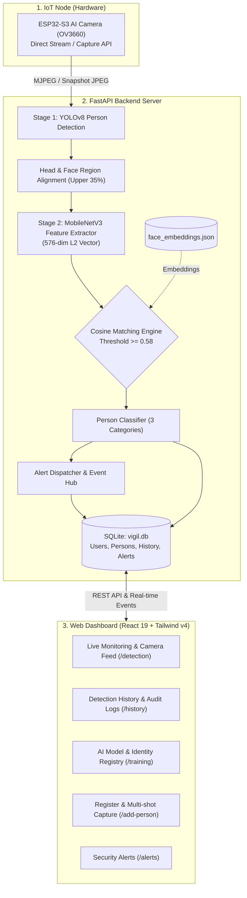
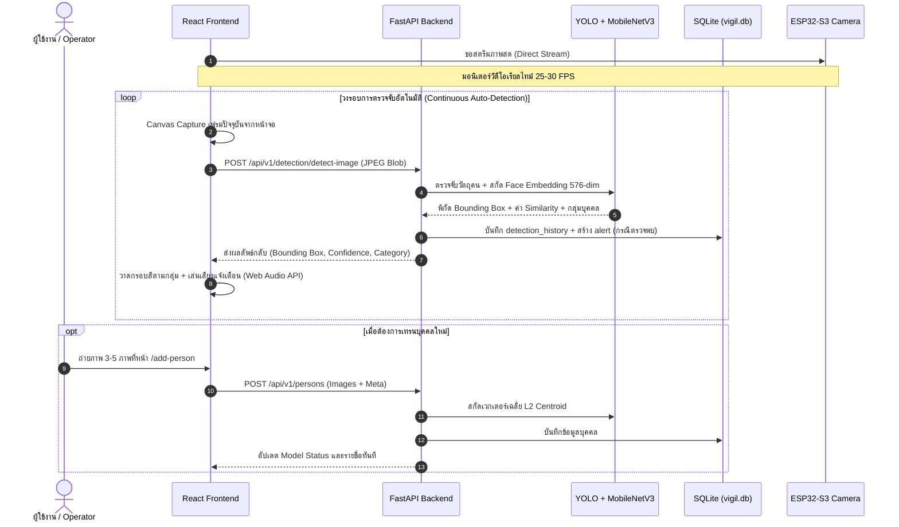

# Vigil — System Architecture Documentation
ระบบตรวจจับและจดจำใบหน้าอัจฉริยะ (AI Smart Security & IoT Face Recognition System)

---

## 1. ภาพรวมระบบ (System Overview)

**Vigil** เป็นระบบรักษาความปลอดภัยอัจฉริยะที่เชื่อมต่ออุปกรณ์ **IoT (ESP32-S3 AI Camera)** เข้ากับสถาปัตยกรรม **Deep Learning AI (YOLOv8 + MobileNetV3 Metric Learning)** และเว็บแดชบอร์ด **React 19** แบบเรียลไทม์

ระบบได้รับการออกแบบให้จำแนกบุคคลที่เดินผ่านกล้องออกเป็น **3 กลุ่มบุคคล** พร้อมระบบแจ้งเตือนอัตโนมัติ การบันทึกประวัติเหตุการณ์ และการเทรนจดจำใบหน้าได้ทันทีจากหน้าเว็บ

---

## 2. การจำแนกบุคคล 3 กลุ่ม (The 3 Classification Categories)

ระบบจัดการความปลอดภัยโดยแบ่งประเภทบุคคลออกเป็น 3 กลุ่ม เพื่อตอบสนองต่อระดับความเสี่ยงที่ต่างกัน:

| กลุ่มบุคคล | ป้ายกำกับ (Category) | สีประจำกลุ่ม (UI) | เกณฑ์การจำแนก | พฤติกรรมระบบและการแจ้งเตือน |
| :--- | :--- | :--- | :--- | :--- |
| **คนในบ้าน** | `household` | 🟢 เขียว (`#2e7d32`) | จับคู่กับสมาชิกในบ้านที่ลงทะเบียนไว้สำเร็จ (Cosine Similarity $\ge 0.58$) | • แสดงชื่อสมาชิกจริง • ป้ายสถานะ: ปลอดภัย (`VERIFIED OK`) • แจ้งเตือนระดับ `info` ยินดีต้อนรับกลับบ้าน |
| **คนส่งของ** | `delivery` | 🟡 ส้ม/อำพัน (`#e65100`) | ตรวจพบคู่สีเครื่องแบบพัสดุ (Flash, Kerry, Grab) หรือลงทะเบียนเป็นไรเดอร์ประจำ | • แสดงชื่อขนส่งหรือชื่อไรเดอร์ • ป้ายสถานะ: พัสดุมาส่ง (`DELIVERY EVENT`) • แจ้งเตือนระดับ `info/notice` ให้ทราบว่ามีพัสดุมาส่ง |
| **คนแปลกหน้า** | `stranger` | 🔴 แดง (`#c62828`) | ไม่ตรงกับฐานข้อมูลใบหน้าที่เทรนไว้ และไม่มีเครื่องแบบขนส่ง | • ระบุเป็นบุคคลแปลกหน้า (Stranger) • ป้ายสถานะ: เฝ้าระวัง (`ALERT RECORDED`) • **สร้าง Security Alert ระดับ `warning` หรือ `critical` ทันที** |

---

## 3. ผังข้อมูลและลำดับการทำงาน (Data Flow & Sequence)

---

## 4. ภาพรวมเทคโนโลยี (Technology Stack)

| ส่วนประกอบ | เทคโนโลยี | เวอร์ชัน / รายละเอียด |
| :--- | :--- | :--- |
| **Frontend Framework** | React | `^19.2.8` |
| **Frontend Routing** | React Router | `^8.3.1` (Data Router + Protected/Guest Guards) |
| **CSS Framework** | Tailwind CSS | `^4.3.3` (Peach & Cream Theme Palette) |
| **Icons** | Lucide React | Modern Minimal IoT Icons |
| **Backend Framework** | FastAPI (Python) | High-performance Async Web Framework |
| **ORM & Database** | SQLAlchemy 2.0 + SQLite | Local database `vigil.db` พร้อม Auto-seeding |
| **Authentication** | PyJWT + Bcrypt | Stateless JWT Bearer Token |
| **Object Detection** | Ultralytics YOLOv8 | `yolov8n` สำหรับระบุ Bounding Box ของร่างกายบุคคล |
| **Feature Extraction** | MobileNetV3-Small | L2-normalized 576-dimensional metric embeddings |
| **IoT Hardware** | DFRobot ESP32-S3 | เซ็นเซอร์ OV3660, รองรับ MJPEG Stream และ Snapshot |

---

## 5. สารบัญเอกสารที่เกี่ยวข้อง (Related Documentation)

- 📘 [Backend API & Database Schema](backend-api.md): ข้อมูลจำเพาะ API, ตารางฐานข้อมูล และความปลอดภัย
- 🧠 [AI & Vision Pipeline](ai-vision.md): การทำงานของโมเดล YOLO, Metric Learning และเทคนิคการเทรนใบหน้า
- 💻 [Frontend Architecture](frontend.md): โครงสร้างหน้าเว็บ, ระบบตรวจจับต่อเนื่อง และดีไซน์ซิสเต็ม
- 📡 [Hardware & IoT](hardware-iot.md): คู่มือบอร์ด ESP32-S3, โค้ด Arduino และการเชื่อมต่อเครือข่าย
