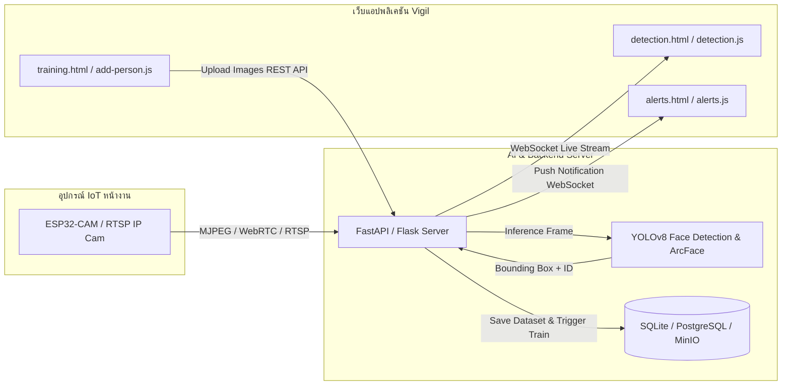

# Vigil — AI Smart Security & IoT Face Recognition System
เอกสารโครงสร้างระบบและคู่มือสถาปัตยกรรมโปรเจค (Project Architecture & Documentation)

---

## 1. ภาพรวมของโปรเจค (Project Overview)

**Vigil** คือระบบตรวจจับและจดจำใบหน้าผู้มาเยือนอัจฉริยะ (AI Smart Security & Visitor Recognition System) ที่ออกแบบมาเพื่อทำงานร่วมกับอุปกรณ์ IoT (เช่น กล้อง ESP32-CAM หรือ กล้องวงจรปิด IP Camera) เพื่อเพิ่มความปลอดภัยให้กับบ้าน สำนักงาน หรืออาคารอัจฉริยะ

### ฟีเจอร์หลัก (Key Features)
- **Live Detection & Monitoring**: มอนิเตอร์ภาพสดจากกล้อง แสดงกรอบตรวจจับใบหน้า (Face Bounding Box) และสถิติผู้มาเยือนประจำวันแบบเรียลไทม์
- **Person Database**: จัดการฐานข้อมูลบุคคล แยกประเภทชัดเจน ได้แก่ พนักงาน (Employee), สมาชิกในครอบครัว (Family), ผู้มาติดต่อ (Visitor), บุคคลสำคัญ (VIP) และบุคคลเฝ้าระวัง (Blacklist)
- **AI Model & GPU Training Dashboard**: ติดตามความคืบหน้าการเทรนโมเดล YOLOv8, ค่า Loss, mAP Score และจำลองการประมวลผล GPU แบบสด
- **Register New Person & Dataset Upload**: ลงทะเบียนบุคคลใหม่พร้อมอัปโหลดชุดภาพใบหน้า (Face Dataset) หรือถ่ายภาพสดผ่านกล้อง
- **Real-Time Security Alerts**: บันทึกและแจ้งเตือนเหตุการณ์ความปลอดภัย เช่น บุคคลแปลกหน้า หรือบุคคลในบัญชีดำเดินผ่านกล้อง
- **Modern Responsive Design**: ดีไซน์ระดับพรีเมียม โทนสีอบอุ่น (Peach & Cream Modern Aesthetic) สะอาดตา ใช้งานได้บนทุกขนาดหน้าจอ

---

## 2. โครงสร้างโปรเจค (Project Directory Structure)

โปรเจคได้รับการจัดระเบียบให้เป็นแบบ **Modular Architecture** แยกโครงสร้าง (HTML), สไตล์ (CSS) และฟังก์ชันการทำงาน (JavaScript) ออกจากกันอย่างชัดเจน:

```text
project/
├── index.html                  # [Page] หน้าแรก Landing Page แนะนำระบบ Vigil
├── detection.html              # [Page] หน้ามอนิเตอร์กล้องสดและตรวจจับใบหน้า
├── training.html               # [Page] หน้าฐานข้อมูลบุคคลและสถานะการเทรนโมเดล AI
├── add-person.html             # [Page] หน้าลงทะเบียนบุคคลใหม่และอัปโหลดชุดภาพ
├── alerts.html                 # [Page] หน้ารายการแจ้งเตือนความปลอดภัย
├── login.html                  # [Page] หน้าเข้าสู่ระบบ (Authentication)
├── signup.html                 # [Page] หน้าสมัครสมาชิกใหม่
│
├── css/                        # [Stylesheets] โฟลเดอร์รวมไฟล์สไตล์ชีตแยกตามโมดูล
│   ├── main.css                # ตัวแปรสีหลัก (Design Tokens), Typography, Topbar, Status, Resets
│   ├── landing.css             # สไตล์เฉพาะหน้าแรก (Hero, Glow background, Features)
│   ├── detection.css           # สไตล์หน้า Detection (Stats Grid, Camera Feed, Recent Visitors)
│   ├── training.css            # สไตล์หน้า Training (Filters, People Grid, Model Info, GPU Console)
│   ├── add-person.css          # สไตล์หน้าลงทะเบียน (Form, Tag Selector, Upload Dropzone)
│   ├── alerts.css              # สไตล์หน้าระบบแจ้งเตือน (Alert List, Unread Badges)
│   └── auth.css                # สไตล์หน้า Login และ Signup โทนทันสมัย
│
├── js/                         # [JavaScript] โฟลเดอร์รวมสคริปต์แยกตามฟังก์ชัน
│   ├── main.js                 # ระบบตรวจจับเมนูปัจจุบัน (Active Nav) และ Toast Utility
│   ├── detection.js            # จำลองเวลาสดบนฟีดกล้อง (Clock/FPS) และการตรวจจับ
│   ├── training.js             # ค้นหารายชื่อบุคคลแบบเรียลไทม์, ฟิลเตอร์หมวดหมู่, ควบคุม GPU
│   ├── add-person.js           # ตัวนับจำนวนรูปภาพ, พรีวิว, จำลองเว็บแคม, ตรวจสอบฟอร์ม
│   ├── alerts.js               # กรองแจ้งเตือน Unread/All, มาร์กสถานะอ่านแล้ว
│   └── auth.js                 # จัดการฟอร์มเข้าสู่ระบบและสมัครสมาชิก
│
├── project.md                  # [Documentation] เอกสารคู่มือและสถาปัตยกรรมฉบับนี้
└── README.md                   # [Documentation] สรุปข้อมูลโปรเจคและวิธีเปิดใช้งานเบื้องต้น
```

---

## 3. รายละเอียดแต่ละหน้าและการทำงาน (Pages & Component Architecture)

### 3.1 หน้าแรก (`index.html`)
- **Top Bar**: เมนูนำทางแบบ Capsule (`.nav-pills`) เชื่อมโยงไปยังหน้า Detection, Training, Alerts พร้อมปุ่ม Login / Sign Up
- **Hero Section**: ข้อความหลักที่เน้นจุดเด่นของระบบ พร้อมปุ่ม Call to Action (`GET STARTED`) นำทางเข้าสู่ระบบมอนิเตอร์
- **Feature Highlights**: สรุปจุดเด่นด้าน YOLOv8 Face Detection, ESP32-CAM Support, Real-Time Alerts

### 3.2 หน้าตรวจจับใบหน้า (`detection.html`)
- **Metric Cards**: บัตรแสดงสถิติประจำวัน 4 ช่อง (จำนวนผู้มาเยือน, ระบุตัวตนได้, ไม่ทราบตัวตน, ภัยคุกคาม)
- **Live Camera Feed**: กรอบแสดงภาพจากกล้องวงจรปิด พร้อมกรอบ Face Detection Box และข้อมูล Metadata (เวลา, FPS, Resolution)
- **Recent Visitors**: รายชื่อผู้มาเยือนล่าสุด แสดงชื่อ, เวลาที่ตรวจพบ และแท็กสถานะ (`KNOWN` / `UNKNOWN`)

### 3.3 หน้าฐานข้อมูลและการเทรนโมเดล (`training.html`)
- **Search & Filter**: ช่องค้นหาบุคคลตามชื่อแบบ Real-time และปุ่มฟิลเตอร์ประเภท (All, Employee, Visitor, Family, VIP, Blacklist)
- **People Cards Grid**: การ์ดแสดงข้อมูลของแต่ละคน (ชื่อ, รูป Avatar ตัวย่อ, ประเภท, จำนวนภาพใน Dataset, ค่าความแม่นยำ Confidence Score)
- **YOLO Training Monitor**: แสดงสถิติโมเดล (Dataset Size, Epochs, mAP Score)
- **GPU Terminal & Controls**: จำลองคอนโซลแสดง Loss/mAP ของแต่ละ Epoch และปุ่ม Stop / Resume การเทรน

### 3.4 หน้าลงทะเบียนบุคคลใหม่ (`add-person.html`)
- **Identity Details Form**: กรอกชื่อ-นามสกุล, เลือกประเภทบุคคลผ่านแท็กปุ่มกด, กรอกหมายเหตุเพิ่มเติม
- **Training Dataset**:
  - อัปโหลดไฟล์ภาพชุดใบหน้า (Drag & Drop หรือคลิกเลือกไฟล์)
  - ถ่ายภาพสดผ่านกล้อง (Live Webcam Capture Simulation)
  - ตัวนับจำนวนภาพที่แนะนำ (อย่างน้อย 15 ภาพ)
- **Form Actions**: ปุ่มยกเลิกและปุ่มบันทึกเพื่อเริ่มส่งข้อมูลเข้ากระบวนการเทรน

### 3.5 หน้าระบบแจ้งเตือน (`alerts.html`)
- **Filter Unread**: ปุ่มสลับมุมมองระหว่าง "รายการทั้งหมด" กับ "เฉพาะที่ยังไม่ได้อ่าน"
- **Alert Items**: รายการเหตุการณ์แจ้งเตือน แบ่งตามระดับความรุนแรง (CRITICAL, HIGH, NORMAL) สามารถคลิกเพื่อสลับสถานะอ่านแล้วได้

### 3.6 หน้าการยืนยันตัวตน (`login.html` & `signup.html`)
- การ์ดฟอร์มโมเดิร์น โทนสีอบอุ่นเข้ากับธีมของระบบ
- มีระบบตรวจสอบความถูกต้องก่อนส่งข้อมูล และเปลี่ยนเส้นทางเข้าสู่แดชบอร์ด

---

## 4. ระบบดีไซน์ (Design System Tokens)

สไตล์ทั้งหมดกำหนดไว้ใน [`css/main.css`](file:///c:/Users/user/Desktop/project/css/main.css) ในรูปของ CSS Custom Properties เพื่อความสะดวกในการปรับแต่งธีม:

| Variable | ค่าสี | การนำไปใช้งาน |
| :--- | :--- | :--- |
| `--peach` | `#f5c9a8` | สีหลักของแบรนด์ (Primary Accent), Topbar, กรอบ Face Box, ปุ่มเด่น |
| `--peach-dark` | `#e8b48a` | สีเมื่อ Hover ปุ่ม หรือเมื่อ Focus ฟอร์ม |
| `--bg` | `#f7f1e9` | สีพื้นหลังหลักของเว็บไซต์ (Warm Cream) |
| `--card` | `#ffffff` | สีพื้นหลังของกล่องการ์ดและพาเนล |
| `--text` | `#1a1a1a` | สีตัวอักษรหลัก (High Contrast) |
| `--muted` | `#6b6b6b` | สีตัวอักษรรอง ข้อความอธิบาย |
| `--border` | `#e8e0d5` | สีเส้นขอบกล่องและตาราง |
| `--green` / `--green-bg` | `#2e7d32` / `#e8f5e9` | สถานะปกติ, บุคคลที่รู้จัก (Known/OK) |
| `--red` / `--red-bg` | `#c62828` / `#ffebee` | สถานะเตือนภัย, บุคคลแปลกหน้า/บัญชีดำ (Danger/Blacklist) |
| `--cyan` / `--cyan-bg` | `#26a69a` / `#e0f2f1` | สถานะพนักงาน (Employee) |
| `--yellow` / `--yellow-bg`| `#f9a825` / `#fff8e1` | สถานะครอบครัว/VIP (Family/VIP) |

---

## 5. สถาปัตยกรรมการเชื่อมต่อ IoT & AI Backend (IoT & AI Integration Guide)

โครงสร้างโค้ดส่วนหน้าถูกออกแบบให้เชื่อมต่อกับฮาร์ดแวร์ IoT และ AI Model ฝั่งเซิร์ฟเวอร์ได้อย่างง่ายดาย:



### 5.1 การเชื่อมต่อฟีดกล้อง IoT (ESP32-CAM / IP Camera)
- **MJPEG Stream**: เปลี่ยน `<div class="camera-feed">` ให้บรรจุแท็ก `:81/stream">` หรือรับสตรีมผ่าน WebRTC / HLS
- **WebSocket Telemetry**: ใน [`js/detection.js`](file:///c:/Users/user/Desktop/project/js/detection.js) สามารถเปิด WebSocket Connection เพื่อรับพิกัด Bounding Box `[x, y, w, h]` และชื่อบุคคลที่ระบบ AI ตรวจพบแบบสดๆ

### 5.2 การเชื่อมต่อ AI Pipeline (YOLOv8 + Face Recognition)
1. **Face Detection**: ใช้โมเดล YOLOv8n-face ตรวจหากรอบใบหน้าในแต่ละเฟรม
2. **Face Feature Extraction**: ใช้ ArcFace / FaceNet แปลงภาพใบหน้าเป็น Vector Embedding ขนาด 512 มิติ
3. **Identity Matching**: นำไปเปรียบเทียบ Cosine Similarity กับฐานข้อมูลบุคคลที่ลงทะเบียนไว้ในหน้า `training.html`
4. **Trigger Alert**: หากคะแนนความคล้ายคลึงน้อยกว่า Threshold หรือตรงกับบุคคลในหมวด Blacklist ให้สร้าง Alert ส่งมายังหน้า `alerts.html` และส่งแจ้งเตือนผ่าน LINE Notify หรือ Telegram Bot

---

## 6. วิธีการเปิดใช้งานโปรเจค (How to Run)

โปรเจคสร้างด้วยมาตรฐาน Pure HTML5, Vanilla CSS3 และ Modern JavaScript ไม่จำเป็นต้องติดตั้ง Node.js หรือคอมไพล์โค้ด สามารถรันได้ทันที:

### วิธีที่ 1: ใช้ VS Code Live Server (แนะนำ)
1. เปิดโฟลเดอร์โปรเจคใน Visual Studio Code
2. ติดตั้ง Extension **Live Server** (โดย Ritwick Dey)
3. คลิกขวาที่ไฟล์ `index.html` แล้วเลือก **"Open with Live Server"**

### วิธีที่ 2: ใช้ Python Local Server
เปิด Terminal หรือ PowerShell ในโฟลเดอร์โปรเจค แล้วรันคำสั่ง:
```bash
python -m http.server 5500
```
จากนั้นเปิดเบราว์เซอร์ไปที่: `http://localhost:5500`

### วิธีที่ 3: เปิดไฟล์โดยตรง
ดับเบิลคลิกที่ไฟล์ `index.html` เพื่อเปิดใช้งานบน Web Browser ได้ทันที

---

## 7. สรุปผลการปรับปรุงโครงสร้าง (Refactoring Summary)

| รายการเดิม | การปรับปรุงใหม่ | ประโยชน์ที่ได้รับ |
| :--- | :--- | :--- |
| รวม `<style>` ไว้ในทุกไฟล์ HTML | แยกออกเป็น `css/main.css` และไฟล์ CSS ประจำหน้า | ลดความซ้ำซ้อนของโค้ด แก้ไขสีหรือฟอนต์จุดเดียวมีผลทั้งระบบ |
| ใช้ `style.css` เก่าที่สไตล์ขัดแย้งกัน | สร้าง `css/auth.css` ใหม่ในธีม Vigil | หน้า Login/Signup สวยงาม กลมกลืนกับหน้าแดชบอร์ด |
| มีไฟล์ `training.css` ตกค้างไม่ได้ใช้งาน | จัดระเบียบและเขียนใหม่ใน `css/training.css` | โค้ดสะอาด ไม่มีไฟล์ขยะ |
| สคริปต์ JavaScript ปนอยู่ใน HTML | แยกออกเป็นโฟลเดอร์ `js/` แต่ละหน้ามีสคริปต์เฉพาะ | ดูแลรักษาง่าย โค้ดเป็นสัดส่วน (Separation of Concerns) |
| เอกสาร `README.md` เสียหาย (`???`) | ปรับปรุงเป็น UTF-8 และเขียน `project.md` ฉบับสมบูรณ์ | มีเอกสารอ้างอิงมาตรฐานสำหรับส่งงานและพัฒนาต่อยอด |
